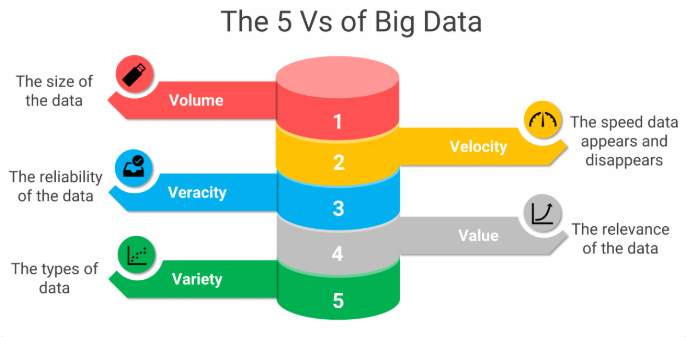

# Big Data - Massive amounts of Data

## Where does it come from?
- Social Media
- Logs (recorded events withing a system, application or network)
- User-Generated Content (forums, blogs, reports)
- Real time (websites, IoT devices)
- GPS Data
- Financial transactions
- Public data (research institutions)
- Scientific data (science research)
- Multimedia (video, image, audio)

## Enablers
- Big data has been around for time, however we have never been able to leverage the data
- Now possible with advanced hardware
- Reduced storage costs
- Open source
- Internet
- Off the shelf computers

## What is Big Data used for
- Used to make predictions
- Spot early trends to make predictions
- Algorithmic Trading: Use historical and real-time data to make trades
- Security & Surveillance: Monitor for threats using data feeds.
- Marketing Personalization: Target ads and content more effectively.

## What makes Data Big - The 5vs to consider
- When it exceeds the capabilities of traditional approaches and tools
- Too large to handle with excel, standard SQL databases
- When it requires distributed computing like cloud based systems
- When the data is being generated rapidly and real-time processing is needed (social media, high-frequency trading)
- Needs ML or NoSql databases to extract insights

## How to deal with Big Data
- Distributed Systems (horizontally scale)
- Vertically scale

Popular tools
Case studies/Use cases
New methodologies/concepts/ideas
Concepts that didn't go anywhere
etc.
